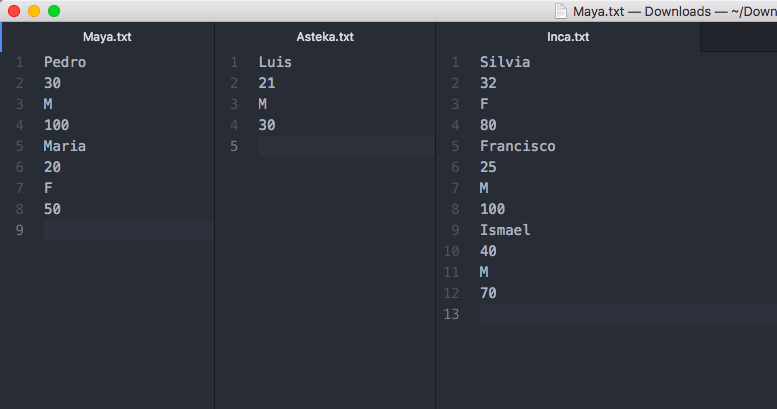

# Objetivo

Realizar la definición de datos así como la implementación para la manipulación efectiva de los datos, usando las estructuras de datos siguientes:

* Arreglo Dinámico
* Lista Ligada
* Pilas y Colas
* Árboles Binarios de Búsqueda
* Grafos

Se requiere prototipar usando memoria dinámica la estructura y administración de la información de un videojuego, basado en el género "estrategia en tiempo real" (Age of Empires, Warcraft, etc), teniendo como base las siguientes entidades u objetos:

* Civilizaciones
* Mapa
* Unidades (aldeanos, guerreros, etc) (inf) 
* Recursos (comida, oro, etc) (inf)

Las civilizaciones se deberán de almacenar en memoria secundaria (archivo) para cargase cada vez que se ejecute el programa, así como los aldeanos y guerreros. Con lo anterior será necesario mantener en memoria las civilizaciones, aldeanos y guerreros de cada civilización usando estructuras de datos.

El mapa será representado con una una matriz dinámica (grafo), en donde estarán las unidades y los recursos.
Las unidades y los recursos representan objetos ya definidos, que más adelante se darán sus características. 

* Las unidades son objetos específicos de cada civilización. 
* Los recursos son únicamente para el mapa.
* El mapa será representado con una una matriz dinámica (grafo), en donde estarán las unidades y los recursos.
 
## Actividad 01 _(Clases, apuntadores, memoria dinámica, arreglo dinámico)_

Implementar la clase Aldeano[1] con los siguientes atributos:

* Nombre
* Edad
* Género
* Salud

Implementar la clase Civilización[2] con los siguientes atributos:

* Nombre
* Arreglo Dinámico de aldeanos[3]

y los siguientes métodos:

+ Agregar aldeano _(recibe un objeto de tipo Aldeano)_
+ Eliminar aldeano _(por nombre, recibe el nombre del aldeano a eliminar)_
+ Población total _(regresa la cantidad de aldeanos en el arreglo dinámico)_

Implementar un menú para manipular un objeto de la clase civilización, con las siguientes opciones:

1. Nombre de la civilización (le pone un nombre a la civilización)
2. Agregar aldeano (pide los datos del aldeano y lo agrega a la civilización)
3. Eliminar aldeano (pregunta por el nombre del aldeano)
4. Resumen (Imprime el nombre de la civilización, la población total y cada aldeano consu nombre, edad y salud).
5. Salir

[1]: Crear los métodos de acceso para los atributos.

[2]: El comportamiento de la clase Civilización será como una administradora de objetos de la clase Aldeano.

[3]: Reutilizar la plantilla (template) de la clase Arreglo desarrollada en el laboratorio para hacer un Arreglo<Aldeano>.
 
 ## Actividad 02 _(Lista Simplemente Ligada)_
 
 Implementar un menú para manipular una lista simplemente ligada de apuntadores de objetos de la clase Civilización[4], con las siguientes opciones:
 
1. Agregar civilización a la lista simplemente ligada
2. Buscar civilización
3. Eliminar civilización
4. Mostrar Civilizaciones
5. Salir

La opción _Agregar civilización a la lista simplemente ligada_ creará un objeto apuntador de la clase Civilización de la siguiente manera:

```c++
void agregarCivilizacion(Lista<Civilizacion*> &lista)
{
    // definicion de variables
    string nombre;
    Civilizacion *c = new Civilizacion();
    cout << "Nombre de la Civilizacion: " << endl;
    getline(cin, nombre);
    c->setNombre(nombre);
    // insertar en la lista el objeto *c
    lista.insertar_inicio(c);
}
```

La opción _Buscar civilización_ pedirá el nombre de una civilización, si la civilización no existe, mostrar un mensaje. Si existe la civilización, mostrar el menú de la actividad 01[5].

La opción _Eliminar civilización_ pedirá el nombre de una civilización y eliminará el nodo de la lista simplemente ligada que corresponda a la civilización con ése nombre.

La opción _Mostrar Civilizaciones_ muestra en pantalla el nombre de la civilización y su población.

[4]: Reutilizar la plantilla de la clase Lista desarrollada en el laboratorio para hacer una Lista<Civilizacion*>

[5]: Agregar Aldeano, Eliminar Aldeano, Población y Resumen.
 
## Actividad 03 _(Lista Doblemente Ligada)_

Agregar la característica para respaldar las civilizaciones junto a sus respectivos aldeanos. Lo anterior deberá ser parte del menú de la actividad 02 (Civilizaciones), la cual hará lo siguiente:


+ Respaldar: guardará en un archivo las civilizaciones que están en la lista simplemente ligada junto a sus aldeanos.
+ Recuperar: leerá el archivo antes creado (respaldo) para ir agregando civilizaciones con sus respectivos aldeanos.

Una idea para poder respaldar es la siguiente [6]:


1 Crear el archivo “civilizaciones.txt”, e ir escribiendo el nombre de cada civilización, separadas por un salto de línea. 
2 Por cada civilización, se deberá crear un nuevo archivo con el nombre de la civilización, y ahí guardar los aldeanos. 
3 Los aldeanos al tener solamente 4 atributos (nombre, edad, género, salud), será necesario siempre 4 líneas (una línea por atributo).


Ejemplo:

```c++
void respaldar(Lista<Civilizaciones*> &civilizaciones)
{
 ofstream archivo("civilizaciones.txt", ios::out);

 for (int i = 0; i < civilizaciones.tamano(); i++) {
  archivo << civlizaciones[i]->getNombre() << endl;
  ofstream aldeanos(civilizaciones[i]->getNombre() + ".txt", ios::out);
  for (int j = 0; j < civilizaciones[i]->poblacion(); j++) {
   // obtengo el puntero de civilizacion
   Civilizacion *c = civilizaciones[i]; 
   // salto a la civilizacion y obtengo la referencia (no hace copia)
   // del aldeano "j"
   Aldeano &aldeano = (*c)[j]  
   aldeanos << aldeano.getNombre() << endl;
   aldeanos << aldeano.getEdad()   << endl;
   aldeanos << aldeano.getGenero() << endl;
   aldeanos << aldeano.getSalud()  << endl;
  }
  aldeanos.close();
 }
 archivo.close();
}
```

Lo anterior generará el archivo "civilizaciones.txt”  con los nombres de cada civilización, 3 archivos con el nombre de cada civilización conteniendo la información de los aldeanos.




[6]: Este algoritmo es solamente una idea por si no se te ocurre como implementarlo.

## Actividad 04 _(Lista Doblemente Ligada)_

Implementar la clase Guerrero, la cual tendrá los siguientes atributos [7]:

+ id
+ Salud (0-100)
+ Fuerza (0.0 - 60.0)
+ Escudo (0.0 - 30.0)
+ Tipo de Guerrero (lancero, arquero, paladín, etc) [8]

Agregar a la clase Civilización un objeto de la clase Lista Doblemente Ligada de tipo Guerrero así como un método para agregar un Guerrero al objeto de la clase Lista Doblemenete Ligada.

```c++
#include "listadoble.h"
#include "guerrero.h"

class Civilizacion
{
private:
    ...
    ListaDoble<Guerrero> guerreros;
public:
    Civilizacion();
    ...
    void agregarGuerrero(const Guerrero &g)
    {
        guerreros.insertar_inicio(g);
    }
};
```

Agregar al Menú de Civilización (Actividad 01) las siguientes opciones:

1. Agregar Guerrero.
2. Mostrar todos los Guerreros. 
3. Buscar guerreros por:
 * Salud mayor igual que y menor que el campo de búsqueda.
 * Fuerza mayor igual que y menor que el campo de búsqueda.
 * Clase de guerrero.

4. Eliminar por:
 * id
 * Tipo de guerrero.
 * Salud menor que el campo de búsqueda.

5. Modificar guerrero (pedir el id del guerrero y mostrar un menú para modificar los atributos: salud, fuerza, escudo)

Agregar al método _(Mostrar Civilizaciones)_ para que aparte de mostrar en pantalla el nombre de la civilización y su población, también muestre la población de guerreros (getSize() de la lista doblemente ligada).

Agregar a los métodos de respaldar y recuperar, para que también guarde/recupere los guerreros.

[7]: Implementar sus métodos de acceso (getters/seeter).

[8]: Definir los tipos de guerrero (mínimo 4 tipos). Pueden estar definidos en la opción del menú, usando un  [enumerador](http://en.cppreference.com/w/cpp/language/enum) o cuando se pida el tipo por la consola.


## Actividad 05 _(Cola de Prioridad)_

Implementar la clase Recurso, la cual tendrá los siguientes atributos [9]:

 * Id
 * Cantidad
 * Tipo de Recurso (oro, madera, piedra, comida, etc) [10]

Agregar a la clase Civilización un objeto de la clase Cola de Prioridad de tipo Recurso [11] así como un método para agregar un Recurso al objeto de la clase Cola de Prioridad.

```c++
#include "colaprioridad.h"
#include "recurso.h"

class Civilizacion
{
private:
    ...
    ColaPrioridad<Recurso> recursos;
public:
    Recurso();
    ...
    void agregarRecurso(const Recurso &r)
    {
        recursos.encolar(r);
    }
};
 ```
 
 Agregar al Menú de Civilización (Actividad 02) las siguientes opciones:
 
 1. Agregar Recurso.
 2. Mostrar todos los Recursos. 
 3. Buscar Recursos por:
  * Cantidad mayor igual que y menor que el campo de búsqueda.
  * Tipo de Recurso.
  
 4. Modificar recurso (pedir el id del recurso y mostrar un menú para modificar el atributo cantidad; si la cantidad es igual a 0, eliminar de la cola de prioridad ese recurso).
 
 Agregar al método _(Mostrar Civilizaciones)_ para que aparte de mostrar en pantalla el nombre de la civilización, su población de aldeanos y guerreros, también muestre la cantidad de recursos totales.

Agregar a los métodos de respaldar y recuperar, para que también guarde/recupere los recursos.

[9]: Implementar sus métodos de acceso (getters/setter).

[10]: Definir los tipos de recursos (mínimo 4 tipos). Pueden estar definidos en la opción del menú,  usando un  [enumerador](http://en.cppreference.com/w/cpp/language/enum) o cuando se pida el tipo por la consola.

[11]: ColaPrioridad<Recurso>.

